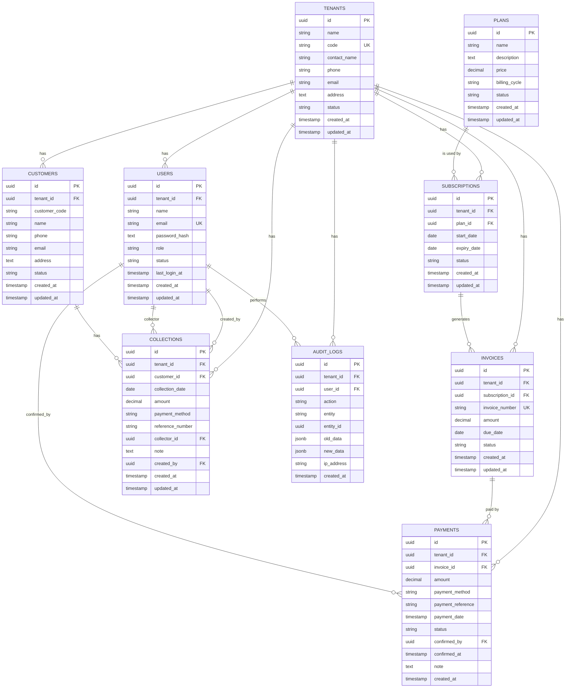

# Daily Collection Management (DCM)
# Database ERD & Schema Specification

**Version:** 1.0  
**Date:** 3 September 2026  
**Project:** Daily Collection Management (DCM)  
**Database:** PostgreSQL  
**ORM:** Prisma  

---

## 1. Entity Relationship Diagram (Text + Mermaid)

### Mermaid ERD



---

## 2. Relationship Summary

```text
TENANTS
 │
 ├── USERS (1:N)                    → ผู้ใช้ขององค์กร
 ├── SUBSCRIPTIONS (1:N)            → การสมัครใช้งาน
 │      └── INVOICES (1:N)
 │             └── PAYMENTS (1:N)
 ├── CUSTOMERS (1:N)                → ลูกค้าของ Tenant
 │      └── COLLECTIONS (1:N)
 └── AUDIT_LOGS (1:N)

PLANS
 └── SUBSCRIPTIONS (1:N)
```

**กฎสำคัญ**
- `SUPER_ADMIN` → `users.tenant_id = NULL`
- ทุกตารางที่เกี่ยวกับข้อมูลธุรกิจต้องมี `tenant_id` (ยกเว้น `plans` และ `SUPER_ADMIN`)
- ทุก Query ของ Tenant User ต้อง Filter ด้วย `tenant_id` จาก JWT

---

## 3. Full Prisma Schema (Recommended)

```prisma
// schema.prisma

generator client {
  provider = "prisma-client-js"
}

datasource db {
  provider = "postgresql"
  url      = env("DATABASE_URL")
}

// ============================================
// Enums
// ============================================

enum TenantStatus {
  ACTIVE
  SUSPENDED
  INACTIVE
}

enum UserRole {
  SUPER_ADMIN
  TENANT_ADMIN
  TENANT_USER
}

enum UserStatus {
  ACTIVE
  DISABLED
}

enum PlanStatus {
  ACTIVE
  INACTIVE
}

enum BillingCycle {
  MONTHLY
  YEARLY
}

enum SubscriptionStatus {
  ACTIVE
  PENDING_PAYMENT
  EXPIRED
  SUSPENDED
  CANCELLED
}

enum InvoiceStatus {
  PENDING
  PAID
  OVERDUE
  CANCELLED
}

enum PaymentMethod {
  BANK_TRANSFER
  QR_CODE
  CASH
  OTHER
}

enum PaymentStatus {
  PENDING
  CONFIRMED
  REJECTED
  CANCELLED
}

enum CustomerStatus {
  ACTIVE
  DISABLED
}

enum CollectionPaymentMethod {
  CASH
  BANK_TRANSFER
  QR_CODE
  OTHER
}

// ============================================
// Models
// ============================================

model Tenant {
  id           String       @id @default(uuid()) @db.Uuid
  name         String       @db.VarChar(255)
  code         String       @unique @db.VarChar(50)
  contactName  String?      @map("contact_name") @db.VarChar(255)
  phone        String?      @db.VarChar(50)
  email        String?      @db.VarChar(255)
  address      String?      @db.Text
  status       TenantStatus @default(ACTIVE)
  createdAt    DateTime     @default(now()) @map("created_at")
  updatedAt    DateTime     @updatedAt @map("updated_at")

  users         User[]
  subscriptions Subscription[]
  invoices      Invoice[]
  payments      Payment[]
  customers     Customer[]
  collections   Collection[]
  auditLogs     AuditLog[]

  @@map("tenants")
}

model User {
  id           String     @id @default(uuid()) @db.Uuid
  tenantId     String?    @map("tenant_id") @db.Uuid
  name         String     @db.VarChar(255)
  email        String     @unique @db.VarChar(255)
  passwordHash String     @map("password_hash") @db.Text
  role         UserRole
  status       UserStatus @default(ACTIVE)
  lastLoginAt  DateTime?  @map("last_login_at")
  createdAt    DateTime   @default(now()) @map("created_at")
  updatedAt    DateTime   @updatedAt @map("updated_at")

  tenant              Tenant?      @relation(fields: [tenantId], references: [id])
  collectionsCreated  Collection[] @relation("CreatedBy")
  collectionsAsCollector Collection[] @relation("Collector")
  paymentsConfirmed   Payment[]    @relation("ConfirmedBy")
  auditLogs           AuditLog[]

  @@index([tenantId])
  @@map("users")
}

model Plan {
  id           String       @id @default(uuid()) @db.Uuid
  name         String       @db.VarChar(100)
  description  String?      @db.Text
  price        Decimal      @db.Decimal(12, 2)
  billingCycle BillingCycle @default(MONTHLY) @map("billing_cycle")
  status       PlanStatus   @default(ACTIVE)
  createdAt    DateTime     @default(now()) @map("created_at")
  updatedAt    DateTime     @updatedAt @map("updated_at")

  subscriptions Subscription[]

  @@map("plans")
}

model Subscription {
  id         String             @id @default(uuid()) @db.Uuid
  tenantId   String             @map("tenant_id") @db.Uuid
  planId     String             @map("plan_id") @db.Uuid
  startDate  DateTime           @map("start_date") @db.Date
  expiryDate DateTime           @map("expiry_date") @db.Date
  status     SubscriptionStatus
  createdAt  DateTime           @default(now()) @map("created_at")
  updatedAt  DateTime           @updatedAt @map("updated_at")

  tenant   Tenant    @relation(fields: [tenantId], references: [id])
  plan     Plan      @relation(fields: [planId], references: [id])
  invoices Invoice[]

  @@index([tenantId])
  @@index([status])
  @@index([expiryDate])
  @@map("subscriptions")
}

model Invoice {
  id             String        @id @default(uuid()) @db.Uuid
  tenantId       String        @map("tenant_id") @db.Uuid
  subscriptionId String        @map("subscription_id") @db.Uuid
  invoiceNumber  String        @unique @map("invoice_number") @db.VarChar(100)
  amount         Decimal       @db.Decimal(12, 2)
  dueDate        DateTime?     @map("due_date") @db.Date
  status         InvoiceStatus @default(PENDING)
  createdAt      DateTime      @default(now()) @map("created_at")
  updatedAt      DateTime      @updatedAt @map("updated_at")

  tenant       Tenant       @relation(fields: [tenantId], references: [id])
  subscription Subscription @relation(fields: [subscriptionId], references: [id])
  payments     Payment[]

  @@index([tenantId])
  @@index([status])
  @@map("invoices")
}

model Payment {
  id               String        @id @default(uuid()) @db.Uuid
  tenantId         String        @map("tenant_id") @db.Uuid
  invoiceId        String        @map("invoice_id") @db.Uuid
  amount           Decimal       @db.Decimal(12, 2)
  paymentMethod    PaymentMethod? @map("payment_method")
  paymentReference String?       @map("payment_reference") @db.VarChar(255)
  paymentDate      DateTime?     @map("payment_date")
  status           PaymentStatus @default(PENDING)
  confirmedBy      String?       @map("confirmed_by") @db.Uuid
  confirmedAt      DateTime?     @map("confirmed_at")
  note             String?       @db.Text
  createdAt        DateTime      @default(now()) @map("created_at")

  tenant    Tenant  @relation(fields: [tenantId], references: [id])
  invoice   Invoice @relation(fields: [invoiceId], references: [id])
  confirmer User?   @relation("ConfirmedBy", fields: [confirmedBy], references: [id])

  @@index([tenantId])
  @@index([status])
  @@index([invoiceId])
  @@map("payments")
}

model Customer {
  id           String         @id @default(uuid()) @db.Uuid
  tenantId     String         @map("tenant_id") @db.Uuid
  customerCode String?        @map("customer_code") @db.VarChar(100)
  name         String         @db.VarChar(255)
  phone        String?        @db.VarChar(50)
  email        String?        @db.VarChar(255)
  address      String?        @db.Text
  status       CustomerStatus @default(ACTIVE)
  createdAt    DateTime       @default(now()) @map("created_at")
  updatedAt    DateTime       @updatedAt @map("updated_at")

  tenant      Tenant       @relation(fields: [tenantId], references: [id])
  collections Collection[]

  @@index([tenantId])
  @@index([tenantId, customerCode])
  @@map("customers")
}

model Collection {
  id              String                   @id @default(uuid()) @db.Uuid
  tenantId        String                   @map("tenant_id") @db.Uuid
  customerId      String                   @map("customer_id") @db.Uuid
  collectionDate  DateTime                 @map("collection_date") @db.Date
  amount          Decimal                  @db.Decimal(12, 2)
  paymentMethod   CollectionPaymentMethod? @map("payment_method")
  referenceNumber String?                  @map("reference_number") @db.VarChar(100)
  collectorId     String?                  @map("collector_id") @db.Uuid
  note            String?                  @db.Text
  createdBy       String                   @map("created_by") @db.Uuid
  createdAt       DateTime                 @default(now()) @map("created_at")
  updatedAt       DateTime                 @updatedAt @map("updated_at")

  tenant    Tenant   @relation(fields: [tenantId], references: [id])
  customer  Customer @relation(fields: [customerId], references: [id])
  collector User?    @relation("Collector", fields: [collectorId], references: [id])
  creator   User     @relation("CreatedBy", fields: [createdBy], references: [id])

  @@index([tenantId])
  @@index([tenantId, collectionDate])
  @@index([customerId])
  @@index([collectorId])
  @@map("collections")
}

model AuditLog {
  id        String   @id @default(uuid()) @db.Uuid
  tenantId  String?  @map("tenant_id") @db.Uuid
  userId    String?  @map("user_id") @db.Uuid
  action    String   @db.VarChar(100)
  entity    String?  @db.VarChar(100)
  entityId  String?  @map("entity_id") @db.Uuid
  oldData   Json?    @map("old_data")
  newData   Json?    @map("new_data")
  ipAddress String?  @map("ip_address") @db.VarChar(100)
  createdAt DateTime @default(now()) @map("created_at")

  tenant Tenant? @relation(fields: [tenantId], references: [id])
  user   User?   @relation(fields: [userId], references: [id])

  @@index([tenantId])
  @@index([userId])
  @@index([entity, entityId])
  @@index([createdAt])
  @@map("audit_logs")
}
```

---

## 4. Index Strategy (สรุป)

| Table          | Index                                      | เหตุผล                              |
|----------------|--------------------------------------------|-------------------------------------|
| users          | `tenant_id`                                | Filter ตาม Tenant                   |
| customers      | `tenant_id`, `(tenant_id, customer_code)`  | Search + Isolation                  |
| collections    | `tenant_id`, `(tenant_id, collection_date)`| Daily / Monthly Report              |
| subscriptions  | `tenant_id`, `status`, `expiry_date`       | Cron Job + Enforcement              |
| payments       | `status`, `tenant_id`, `invoice_id`        | Pending Payment List                |
| invoices       | `tenant_id`, `status`                      | Billing                             |
| audit_logs     | `tenant_id`, `entity + entity_id`, `created_at` | Audit Trail                     |

---

## 5. Seed Data แนะนำ (Sprint 0-1)

```text
1. SUPER_ADMIN
   - email: admin@dcm.local
   - role: SUPER_ADMIN
   - tenant_id: null

2. Plan
   - name: Standard
   - price: 5000.00
   - billing_cycle: MONTHLY

3. ตัวอย่าง Tenant (สำหรับ Development)
   - name: Demo Company
   - code: DEMO001
   - status: ACTIVE
```

---

## 6. Business Rules ที่เกี่ยวกับ Database

1. **Tenant Isolation**  
   ทุก Query ของ TENANT_ADMIN / TENANT_USER ต้องมี `WHERE tenant_id = current_user.tenant_id`

2. **Subscription Enforcement**  
   ระบบต้องตรวจสอบ `subscriptions.status = 'ACTIVE'` และ `expiry_date >= CURRENT_DATE` ก่อนอนุญาต Business Operation

3. **Payment Confirmation (Atomic)**  
   ต้องทำภายใน Transaction:
   - Update Payment → CONFIRMED
   - Update Invoice → PAID
   - Update / Extend Subscription
   - Create Audit Log

4. **Soft Delete แนะนำ**  
   สำหรับ `customers` และ `collections` ควรใช้ `status` หรือ `deleted_at` แทนการลบจริงใน Production

5. **Audit Log**  
   ต้องบันทึกทุก Action สำคัญ โดยเฉพาะ:
   - CONFIRM_PAYMENT
   - RENEW_SUBSCRIPTION
   - CREATE/UPDATE/DELETE_COLLECTION
   - SUSPEND/ACTIVATE_TENANT

---

## 7. Migration Order แนะนำ

```text
1. tenants
2. users
3. plans
4. subscriptions
5. invoices
6. payments
7. customers
8. collections
9. audit_logs
```

---

**เอกสารนี้พร้อมใช้เป็นฐานในการสร้าง Prisma Schema และ Database Migration ได้ทันที**

*อัปเดตล่าสุด: 3 September 2026*
