# DCM Architecture v2.0 — Domain Model & Data Architecture

**Version:** 2.0
**Date:** 3 September 2026
**Status:** Architecture Review — Requires Team Approval Before Implementation
**Supersedes:** Architecture Review v1.0, MVP Technical Specification v2.0

---

## 0. Executive Summary

เอกสารนี้อัปเดต Domain Model ของ DCM ให้สอดคล้องกับความต้องการทางธุรกิจที่ครอบคลุมมากขึ้น:

- **Users** = Global identity, M:N with Tenants
- **Customers** = ข้อมูลลูกค้า (แยกจาก financial data)
- **Accounts/Loans** = ภาระหนี้ทางการเงิน (แยกจากข้อมูลลูกค้า)
- **Documents** = เอกสารประกอบ (แยกจากข้อมูลลูกค้า)
- **Appointments** = นัดหมาย/สถานที่ (แยกจากที่อยู่ลูกค้า)
- **Collections/Payments** = การรับชำระ (immutable, audit trail)
- **Audit** = บันทึกทุกการกระทำ

> **⚠️ Product Principle:** DCM คือระบบบริหารข้อมูลภาระหนี้และการรับชำระ ไม่ใช่ระบบ "ไล่ล่าลูกหนี้"

---

## 1. Domain Model Overview

```text
TENANT
│
├── USERS / MEMBERSHIPS
│     └── Global identity + per-tenant role
│
├── CUSTOMERS
│     ├── CONTACT (phone, email)
│     ├── ADDRESS (billing, shipping, etc.)
│     └── DOCUMENTS (ID card, house registration, etc.)
│
├── ACCOUNTS / LOANS
│     ├── INSTALLMENTS (payment schedule)
│     └── BALANCE (real-time outstanding)
│
├── APPOINTMENTS
│     └── LOCATION (collection visit locations)
│
├── COLLECTIONS / PAYMENTS
│     ├── Allocated to Installments
│     └── REVERSALS (immutable corrections)
│
└── AUDIT (every action recorded)
```

---

## 2. Entity Definitions

### 2.1 TENANT

```sql
CREATE TABLE tenants (
    id UUID PRIMARY KEY DEFAULT gen_random_uuid(),
    name VARCHAR(255) NOT NULL,
    code VARCHAR(50) UNIQUE NOT NULL,
    contact_name VARCHAR(255),
    phone VARCHAR(50),
    email VARCHAR(255),
    address TEXT,
    status VARCHAR(30) DEFAULT 'ACTIVE',
    created_at TIMESTAMP DEFAULT CURRENT_TIMESTAMP,
    updated_at TIMESTAMP DEFAULT CURRENT_TIMESTAMP
);
```

**Status:** `ACTIVE | SUSPENDED | INACTIVE`

---

### 2.2 USERS (Global Identity)

> **Rule:** Users are global. One user can belong to multiple tenants.

```sql
CREATE TABLE users (
    id UUID PRIMARY KEY DEFAULT gen_random_uuid(),
    name VARCHAR(255) NOT NULL,
    email VARCHAR(255) UNIQUE NOT NULL,
    password_hash TEXT NOT NULL,
    phone VARCHAR(50),
    platform_role VARCHAR(50) DEFAULT 'USER',
    status VARCHAR(30) DEFAULT 'ACTIVE',
    last_login_at TIMESTAMP,
    created_at TIMESTAMP DEFAULT CURRENT_TIMESTAMP,
    updated_at TIMESTAMP DEFAULT CURRENT_TIMESTAMP
);
```

**Platform Role:** `USER | SUPER_ADMIN`

> **Note:** Tenant-specific roles are in `tenant_memberships`, NOT in `users`.

---

### 2.3 TENANT_MEMBERSHIPS (Junction: User ↔ Tenant)

> **Rule:** One user can belong to multiple tenants with different roles.

```sql
CREATE TABLE tenant_memberships (
    id UUID PRIMARY KEY DEFAULT gen_random_uuid(),
    tenant_id UUID NOT NULL,
    user_id UUID NOT NULL,
    role VARCHAR(50) NOT NULL,
    status VARCHAR(30) DEFAULT 'ACTIVE',
    invited_by UUID,
    joined_at TIMESTAMP DEFAULT CURRENT_TIMESTAMP,
    created_at TIMESTAMP DEFAULT CURRENT_TIMESTAMP,
    updated_at TIMESTAMP DEFAULT CURRENT_TIMESTAMP,

    FOREIGN KEY (tenant_id) REFERENCES tenants(id) ON DELETE CASCADE,
    FOREIGN KEY (user_id) REFERENCES users(id) ON DELETE CASCADE,
    FOREIGN KEY (invited_by) REFERENCES users(id) ON DELETE SET NULL,

    UNIQUE(tenant_id, user_id)
);
```

**Role:** `TENANT_ADMIN | TENANT_USER`
**Status:** `ACTIVE | INVITED | SUSPENDED`

---

### 2.4 CUSTOMERS

> **Rule:** Customer data is separated from financial Account/Loan data.
> A Customer may have multiple Accounts/Loans.

```sql
CREATE TABLE customers (
    id UUID PRIMARY KEY DEFAULT gen_random_uuid(),
    tenant_id UUID NOT NULL,
    customer_code VARCHAR(100),
    name VARCHAR(255) NOT NULL,

    -- Contact Information
    phone VARCHAR(50),
    email VARCHAR(255),
    line_id VARCHAR(100),

    -- Primary Address
    address_line1 TEXT,
    address_line2 TEXT,
    address_city VARCHAR(100),
    address_province VARCHAR(100),
    address_postal_code VARCHAR(10),
    address_country VARCHAR(3) DEFAULT 'THB',

    -- Status (independent from Account/Loan status)
    status VARCHAR(30) DEFAULT 'ACTIVE',

    -- Metadata
    notes TEXT,
    created_by UUID,
    created_at TIMESTAMP DEFAULT CURRENT_TIMESTAMP,
    updated_at TIMESTAMP DEFAULT CURRENT_TIMESTAMP,

    FOREIGN KEY (tenant_id) REFERENCES tenants(id) ON DELETE CASCADE,
    FOREIGN KEY (created_by) REFERENCES users(id) ON DELETE SET NULL
);
```

**Customer Status:** `ACTIVE | INACTIVE | BLACKLISTED`

> **Important:** Customer status is INDEPENDENT from Account/Loan status.
> A customer may remain ACTIVE while a specific account is CLOSED or WRITTEN_OFF.

---

### 2.5 ACCOUNTS / LOANS

> **Rule:** Financial obligation is modeled separately from Customer.
> A Customer may have multiple Accounts/Loans.

```sql
CREATE TABLE accounts (
    id UUID PRIMARY KEY DEFAULT gen_random_uuid(),
    tenant_id UUID NOT NULL,
    customer_id UUID NOT NULL,
    account_number VARCHAR(100) UNIQUE NOT NULL,
    account_type VARCHAR(50) NOT NULL,

    -- Financial Terms
    original_amount DECIMAL(14,2) NOT NULL,
    interest_rate DECIMAL(5,2) DEFAULT 0,
    currency VARCHAR(3) DEFAULT 'THB',
    term_months INTEGER,
    payment_frequency VARCHAR(30) DEFAULT 'MONTHLY',

    -- Dates
    disbursement_date DATE NOT NULL,
    first_due_date DATE,
    maturity_date DATE,

    -- Real-time Balance (updated on every payment/reversal)
    outstanding_balance DECIMAL(14,2) NOT NULL,
    total_paid DECIMAL(14,2) DEFAULT 0,

    -- Status (independent from Customer status)
    status VARCHAR(30) DEFAULT 'ACTIVE',
    classification VARCHAR(30),

    -- Metadata
    notes TEXT,
    created_by UUID,
    created_at TIMESTAMP DEFAULT CURRENT_TIMESTAMP,
    updated_at TIMESTAMP DEFAULT CURRENT_TIMESTAMP,

    FOREIGN KEY (tenant_id) REFERENCES tenants(id) ON DELETE CASCADE,
    FOREIGN KEY (customer_id) REFERENCES customers(id) ON DELETE CASCADE,
    FOREIGN KEY (created_by) REFERENCES users(id) ON DELETE SET NULL
);
```

**Account Type:** `PERSONAL_LOAN | BUSINESS_LOAN | CREDIT_LINE | OTHER`

**Account Status:**
```text
ACTIVE      — กำลังผ่อนชำระ
OVERDUE     — เลยกำหนดชำระ
DELINQUENT  — ค้างชำระเกินกำหนด
PAID_OFF    — ผ่อนชำระครบแล้ว
WRITTEN_OFF — ตัดหนี้
DISPUTED    — มีข้อพิพาท
CLOSED      — ปิดบัญชีแล้ว
```

**Classification (for reporting):**
```text
NORMAL
SPECIAL_MENTION
SUB_STANDARD
DOUBTFUL
LOSS
```

---

### 2.6 INSTALLMENTS (Payment Schedule)

> **Rule:** Each Account has a predefined installment schedule.
> Installments track individual payment obligations.

```sql
CREATE TABLE installments (
    id UUID PRIMARY KEY DEFAULT gen_random_uuid(),
    tenant_id UUID NOT NULL,
    account_id UUID NOT NULL,
    installment_number INTEGER NOT NULL,

    -- Amount
    principal_amount DECIMAL(14,2) NOT NULL,
    interest_amount DECIMAL(14,2) DEFAULT 0,
    total_amount DECIMAL(14,2) NOT NULL,

    -- Dates
    due_date DATE NOT NULL,
    paid_date DATE,

    -- Payments
    amount_paid DECIMAL(14,2) DEFAULT 0,
    penalty_amount DECIMAL(14,2) DEFAULT 0,
    status VARCHAR(30) DEFAULT 'PENDING',

    created_at TIMESTAMP DEFAULT CURRENT_TIMESTAMP,
    updated_at TIMESTAMP DEFAULT CURRENT_TIMESTAMP,

    FOREIGN KEY (tenant_id) REFERENCES tenants(id) ON DELETE CASCADE,
    FOREIGN KEY (account_id) REFERENCES accounts(id) ON DELETE CASCADE,

    UNIQUE(account_id, installment_number)
);
```

**Installment Status:**
```text
PENDING   — ยังไม่ถึงกำหนด
CURRENT   — ถึงกำหนดแล้ว ยังไม่จ่าย
PARTIAL   — จ่ายบางส่วน
PAID      — จ่ายครบ
OVERDUE   — เลยกำหนด
WAIVED    — ยกเว้น
```

---

### 2.7 DOCUMENTS

> **Rule:** Documents are modeled separately from Customer records.
> Supports ID card, house registration, and other supporting documents.

```sql
CREATE TABLE documents (
    id UUID PRIMARY KEY DEFAULT gen_random_uuid(),
    tenant_id UUID NOT NULL,
    customer_id UUID NOT NULL,
    document_type VARCHAR(50) NOT NULL,
    document_number VARCHAR(100),
    document_name VARCHAR(255) NOT NULL,
    file_url TEXT NOT NULL,
    file_size INTEGER,
    mime_type VARCHAR(100),
    issued_date DATE,
    expiry_date DATE,
    issuing_authority VARCHAR(255),
    status VARCHAR(30) DEFAULT 'ACTIVE',
    verified_by UUID,
    verified_at TIMESTAMP,
    notes TEXT,
    created_by UUID,
    created_at TIMESTAMP DEFAULT CURRENT_TIMESTAMP,
    updated_at TIMESTAMP DEFAULT CURRENT_TIMESTAMP,

    FOREIGN KEY (tenant_id) REFERENCES tenants(id) ON DELETE CASCADE,
    FOREIGN KEY (customer_id) REFERENCES customers(id) ON DELETE CASCADE,
    FOREIGN KEY (verified_by) REFERENCES users(id) ON DELETE SET NULL,
    FOREIGN KEY (created_by) REFERENCES users(id) ON DELETE SET NULL
);
```

**Document Type:**
```text
ID_CARD          — บัตรประชาชน
PASSPORT         — หนังสือเดินทาง
HOUSE_REG        — ทะเบียนบ้าน
INCOME_CERT      — ใบรับรองรายได้
BANK_STATEMENT   — ใบแจ้งยอดบัญชีธนาคาร
COLLATERAL_DEED  — โฉนดที่ดิน
CONTRACT         — สัญญา
OTHER            — อื่น ๆ
```

**Status:** `ACTIVE | EXPIRED | VERIFIED | REJECTED`

---

### 2.8 APPOINTMENTS

> **Rule:** Appointment/collection location must be modeled separately.
> Customer address and actual appointment location are NOT necessarily the same.

```sql
CREATE TABLE appointments (
    id UUID PRIMARY KEY DEFAULT gen_random_uuid(),
    tenant_id UUID NOT NULL,
    customer_id UUID NOT NULL,
    account_id UUID,

    -- Appointment Details
    appointment_type VARCHAR(50) NOT NULL,
    scheduled_date DATE NOT NULL,
    scheduled_time TIME,
    actual_date DATE,
    actual_time TIME,

    -- Location (separate from customer address)
    location_id UUID,

    -- Assignment
    assigned_to UUID,
    created_by UUID NOT NULL,

    -- Status
    status VARCHAR(30) DEFAULT 'SCHEDULED',
    outcome VARCHAR(50),
    notes TEXT,

    created_at TIMESTAMP DEFAULT CURRENT_TIMESTAMP,
    updated_at TIMESTAMP DEFAULT CURRENT_TIMESTAMP,

    FOREIGN KEY (tenant_id) REFERENCES tenants(id) ON DELETE CASCADE,
    FOREIGN KEY (customer_id) REFERENCES customers(id) ON DELETE CASCADE,
    FOREIGN KEY (account_id) REFERENCES accounts(id) ON DELETE SET NULL,
    FOREIGN KEY (location_id) REFERENCES appointment_locations(id) ON DELETE SET NULL,
    FOREIGN KEY (assigned_to) REFERENCES users(id) ON DELETE SET NULL,
    FOREIGN KEY (created_by) REFERENCES users(id) ON DELETE CASCADE
);
```

**Appointment Type:**
```text
COLLECTION_VISIT   — ไปเก็บเงิน
FOLLOW_UP          — ติดตามผล
DOCUMENT_COLLECTION — เก็บเอกสาร
DISPUTE_MEETING    — นัดเจรจา
OTHER              — อื่น ๆ
```

**Status:** `SCHEDULED | IN_PROGRESS | COMPLETED | CANCELLED | NO_SHOW`

**Outcome:**
```text
PAID_FULL       — ลูกค้าจ่ายครบ
PAID_PARTIAL    — ลูกค้าจ่ายบางส่วน
PROMISED        — ลูกค้าสัญญาจะจ่าย
REFUSED         — ลูกค้าปฏิเสธ
NOT_FOUND       — ไม่พบลูกค้า
RESCHEDULED     — นัดใหม่
DISPUTE         — มีข้อพิพาท
```

---

### 2.9 APPOINTMENT_LOCATIONS

> **Rule:** Customer address and appointment location are separate concepts.
> A customer may have multiple possible collection locations.

```sql
CREATE TABLE appointment_locations (
    id UUID PRIMARY KEY DEFAULT gen_random_uuid(),
    tenant_id UUID NOT NULL,
    customer_id UUID,
    location_name VARCHAR(255) NOT NULL,
    location_type VARCHAR(50) NOT NULL,
    address_line1 TEXT,
    address_line2 TEXT,
    address_city VARCHAR(100),
    address_province VARCHAR(100),
    address_postal_code VARCHAR(10),
    latitude DECIMAL(10,7),
    longitude DECIMAL(10,7),
    phone VARCHAR(50),
    contact_person VARCHAR(255),
    notes TEXT,
    is_default BOOLEAN DEFAULT FALSE,
    status VARCHAR(30) DEFAULT 'ACTIVE',
    created_at TIMESTAMP DEFAULT CURRENT_TIMESTAMP,
    updated_at TIMESTAMP DEFAULT CURRENT_TIMESTAMP,

    FOREIGN KEY (tenant_id) REFERENCES tenants(id) ON DELETE CASCADE,
    FOREIGN KEY (customer_id) REFERENCES customers(id) ON DELETE SET NULL
);
```

**Location Type:**
```text
HOME          — ที่อยู่อาศัย
WORK          — ที่ทำงาน
BRANCH        — สาขา
OTHER         — อื่น ๆ
```

---

### 2.10 COLLECTION_PAYMENTS

> **Rule:** Financial records must NOT be destructively deleted.
> Corrections use reversal/correction records with reason, user, and timestamp.

```sql
CREATE TABLE collection_payments (
    id UUID PRIMARY KEY DEFAULT gen_random_uuid(),
    tenant_id UUID NOT NULL,
    account_id UUID NOT NULL,
    customer_id UUID NOT NULL,
    appointment_id UUID,

    -- Payment Details
    amount DECIMAL(14,2) NOT NULL,
    payment_date DATE NOT NULL,
    payment_method VARCHAR(50),
    reference_number VARCHAR(255),

    -- Received by
    received_by UUID,
    created_by UUID NOT NULL,

    -- Status
    status VARCHAR(30) DEFAULT 'CONFIRMED',
    reversal_of UUID,

    -- Metadata
    notes TEXT,
    created_at TIMESTAMP DEFAULT CURRENT_TIMESTAMP,
    updated_at TIMESTAMP DEFAULT CURRENT_TIMESTAMP,

    FOREIGN KEY (tenant_id) REFERENCES tenants(id) ON DELETE CASCADE,
    FOREIGN KEY (account_id) REFERENCES accounts(id) ON DELETE CASCADE,
    FOREIGN KEY (customer_id) REFERENCES customers(id) ON DELETE CASCADE,
    FOREIGN KEY (appointment_id) REFERENCES appointments(id) ON DELETE SET NULL,
    FOREIGN KEY (received_by) REFERENCES users(id) ON DELETE SET NULL,
    FOREIGN KEY (created_by) REFERENCES users(id) ON DELETE CASCADE,
    FOREIGN KEY (reversal_of) REFERENCES collection_payments(id) ON DELETE SET NULL
);
```

**Payment Method:** `CASH | BANK_TRANSFER | QR_CODE | CHEQUE | OTHER`

**Status:** `PENDING | CONFIRMED | REVERSED`

> **⚠️ CRITICAL:** NEVER DELETE collection_payments. Use reversal instead.

---

### 2.11 PAYMENT_ALLOCATIONS

> **Rule:** Each payment can be allocated across multiple installments.

```sql
CREATE TABLE payment_allocations (
    id UUID PRIMARY KEY DEFAULT gen_random_uuid(),
    tenant_id UUID NOT NULL,
    collection_payment_id UUID NOT NULL,
    installment_id UUID NOT NULL,
    allocated_amount DECIMAL(14,2) NOT NULL,
    created_at TIMESTAMP DEFAULT CURRENT_TIMESTAMP,

    FOREIGN KEY (tenant_id) REFERENCES tenants(id) ON DELETE CASCADE,
    FOREIGN KEY (collection_payment_id) REFERENCES collection_payments(id) ON DELETE CASCADE,
    FOREIGN KEY (installment_id) REFERENCES installments(id) ON DELETE CASCADE
);
```

---

### 2.12 REVERSALS

> **Rule:** Every reversal requires a reason, user, and timestamp.
> Reversals are immutable once approved.

```sql
CREATE TABLE reversals (
    id UUID PRIMARY KEY DEFAULT gen_random_uuid(),
    tenant_id UUID NOT NULL,
    original_payment_id UUID NOT NULL,
    reversed_by UUID NOT NULL,
    reason TEXT NOT NULL,
    reversal_date TIMESTAMP DEFAULT CURRENT_TIMESTAMP,
    status VARCHAR(30) DEFAULT 'APPROVED',
    approved_by UUID,
    approved_at TIMESTAMP,
    created_at TIMESTAMP DEFAULT CURRENT_TIMESTAMP,

    FOREIGN KEY (tenant_id) REFERENCES tenants(id) ON DELETE CASCADE,
    FOREIGN KEY (original_payment_id) REFERENCES collection_payments(id) ON DELETE CASCADE,
    FOREIGN KEY (reversed_by) REFERENCES users(id) ON DELETE CASCADE,
    FOREIGN KEY (approved_by) REFERENCES users(id) ON DELETE SET NULL
);
```

**Status:** `PENDING | APPROVED | REJECTED`

---

### 2.13 AUDIT_LOGS

> **Rule:** Every action is recorded. Audit logs are immutable and append-only.

```sql
CREATE TABLE audit_logs (
    id UUID PRIMARY KEY DEFAULT gen_random_uuid(),
    tenant_id UUID,
    user_id UUID,
    action VARCHAR(100) NOT NULL,
    entity VARCHAR(100),
    entity_id UUID,
    old_data JSONB,
    new_data JSONB,
    reason TEXT,
    ip_address VARCHAR(100),
    created_at TIMESTAMP DEFAULT CURRENT_TIMESTAMP,

    FOREIGN KEY (tenant_id) REFERENCES tenants(id) ON DELETE SET NULL,
    FOREIGN KEY (user_id) REFERENCES users(id) ON DELETE SET NULL
);
```

---

## 3. Platform Tables (SaaS Billing — SUPER_ADMIN domain)

These tables manage the SaaS subscription billing. They are SEPARATE from tenant business data.

```sql
-- Platform: Subscription Plans
CREATE TABLE plans (
    id UUID PRIMARY KEY DEFAULT gen_random_uuid(),
    name VARCHAR(100) NOT NULL,
    description TEXT,
    price DECIMAL(12,2) NOT NULL,
    billing_cycle VARCHAR(30) DEFAULT 'MONTHLY',
    status VARCHAR(30) DEFAULT 'ACTIVE',
    created_at TIMESTAMP DEFAULT CURRENT_TIMESTAMP,
    updated_at TIMESTAMP DEFAULT CURRENT_TIMESTAMP
);

-- Platform: Tenant Subscriptions
CREATE TABLE subscriptions (
    id UUID PRIMARY KEY DEFAULT gen_random_uuid(),
    tenant_id UUID NOT NULL,
    plan_id UUID NOT NULL,
    start_date DATE NOT NULL,
    expiry_date DATE NOT NULL,
    status VARCHAR(30) NOT NULL,
    created_at TIMESTAMP DEFAULT CURRENT_TIMESTAMP,
    updated_at TIMESTAMP DEFAULT CURRENT_TIMESTAMP,
    FOREIGN KEY (tenant_id) REFERENCES tenants(id),
    FOREIGN KEY (plan_id) REFERENCES plans(id)
);

-- Platform: Invoices
CREATE TABLE invoices (
    id UUID PRIMARY KEY DEFAULT gen_random_uuid(),
    tenant_id UUID NOT NULL,
    subscription_id UUID NOT NULL,
    invoice_number VARCHAR(100) UNIQUE NOT NULL,
    amount DECIMAL(12,2) NOT NULL,
    due_date DATE,
    status VARCHAR(30) DEFAULT 'PENDING',
    created_at TIMESTAMP DEFAULT CURRENT_TIMESTAMP,
    updated_at TIMESTAMP DEFAULT CURRENT_TIMESTAMP,
    FOREIGN KEY (tenant_id) REFERENCES tenants(id),
    FOREIGN KEY (subscription_id) REFERENCES subscriptions(id)
);

-- Platform: Subscription Payments
CREATE TABLE platform_payments (
    id UUID PRIMARY KEY DEFAULT gen_random_uuid(),
    tenant_id UUID NOT NULL,
    invoice_id UUID NOT NULL,
    amount DECIMAL(12,2) NOT NULL,
    payment_method VARCHAR(50),
    payment_reference VARCHAR(255),
    payment_date TIMESTAMP,
    status VARCHAR(30) DEFAULT 'PENDING',
    confirmed_by UUID,
    confirmed_at TIMESTAMP,
    note TEXT,
    created_at TIMESTAMP DEFAULT CURRENT_TIMESTAMP,
    FOREIGN KEY (tenant_id) REFERENCES tenants(id),
    FOREIGN KEY (invoice_id) REFERENCES invoices(id),
    FOREIGN KEY (confirmed_by) REFERENCES users(id)
);

-- Platform: Customer Portal (for debtors to self-service)
CREATE TABLE customer_users (
    id UUID PRIMARY KEY DEFAULT gen_random_uuid(),
    tenant_id UUID NOT NULL,
    customer_id UUID NOT NULL,
    email VARCHAR(255) UNIQUE NOT NULL,
    password_hash TEXT NOT NULL,
    name VARCHAR(255),
    status VARCHAR(30) DEFAULT 'ACTIVE',
    last_login_at TIMESTAMP,
    created_at TIMESTAMP DEFAULT CURRENT_TIMESTAMP,
    updated_at TIMESTAMP DEFAULT CURRENT_TIMESTAMP,
    FOREIGN KEY (tenant_id) REFERENCES tenants(id),
    FOREIGN KEY (customer_id) REFERENCES customers(id)
);

-- Platform: Role Definitions
CREATE TABLE roles (
    id UUID PRIMARY KEY DEFAULT gen_random_uuid(),
    tenant_id UUID,
    name VARCHAR(100) NOT NULL,
    description TEXT,
    permissions JSONB NOT NULL,
    is_system BOOLEAN DEFAULT FALSE,
    created_at TIMESTAMP DEFAULT CURRENT_TIMESTAMP,
    FOREIGN KEY (tenant_id) REFERENCES tenants(id)
);
```

---

## 4. Complete ERD (Mermaid)

```mermaid
erDiagram
    %% ============================================================
    %% PLATFORM LAYER — SaaS Billing (SUPER_ADMIN domain)
    %% ============================================================

    tenants {
        uuid id PK
        varchar name
        varchar code UK
        varchar contact_name
        varchar phone
        varchar email
        text address
        varchar status
        timestamp created_at
        timestamp updated_at
    }

    plans {
        uuid id PK
        varchar name
        text description
        decimal price
        varchar billing_cycle
        varchar status
        timestamp created_at
        timestamp updated_at
    }

    subscriptions {
        uuid id PK
        uuid tenant_id FK
        uuid plan_id FK
        date start_date
        date expiry_date
        varchar status
        timestamp created_at
        timestamp updated_at
    }

    invoices {
        uuid id PK
        uuid tenant_id FK
        uuid subscription_id FK
        varchar invoice_number UK
        decimal amount
        date due_date
        varchar status
        timestamp created_at
        timestamp updated_at
    }

    platform_payments {
        uuid id PK
        uuid tenant_id FK
        uuid invoice_id FK
        decimal amount
        varchar payment_method
        varchar payment_reference
        timestamp payment_date
        varchar status
        uuid confirmed_by FK
        timestamp confirmed_at
        text note
        timestamp created_at
    }

    %% ============================================================
    %% USER & AUTHENTICATION LAYER
    %% ============================================================

    users {
        uuid id PK
        varchar name
        varchar email UK
        text password_hash
        varchar phone
        varchar platform_role
        varchar status
        timestamp last_login_at
        timestamp created_at
        timestamp updated_at
    }

    tenant_memberships {
        uuid id PK
        uuid tenant_id FK
        uuid user_id FK
        varchar role
        varchar status
        uuid invited_by FK
        timestamp joined_at
        timestamp created_at
        timestamp updated_at
    }

    roles {
        uuid id PK
        uuid tenant_id FK
        varchar name
        text description
        jsonb permissions
        boolean is_system
        timestamp created_at
    }

    customer_users {
        uuid id PK
        uuid tenant_id FK
        uuid customer_id FK
        varchar email UK
        text password_hash
        varchar name
        varchar status
        timestamp last_login_at
        timestamp created_at
        timestamp updated_at
    }

    %% ============================================================
    %% CUSTOMER LAYER — Contact & Documents
    %% ============================================================

    customers {
        uuid id PK
        uuid tenant_id FK
        varchar customer_code
        varchar name
        varchar phone
        varchar email
        varchar line_id
        text address_line1
        text address_line2
        varchar address_city
        varchar address_province
        varchar address_postal_code
        varchar address_country
        varchar status
        text notes
        uuid created_by FK
        timestamp created_at
        timestamp updated_at
    }

    documents {
        uuid id PK
        uuid tenant_id FK
        uuid customer_id FK
        varchar document_type
        varchar document_number
        varchar document_name
        text file_url
        integer file_size
        varchar mime_type
        date issued_date
        date expiry_date
        varchar issuing_authority
        varchar status
        uuid verified_by FK
        timestamp verified_at
        text notes
        uuid created_by FK
        timestamp created_at
        timestamp updated_at
    }

    %% ============================================================
    %% ACCOUNT / LOAN LAYER — Financial Obligations
    %% ============================================================

    accounts {
        uuid id PK
        uuid tenant_id FK
        uuid customer_id FK
        varchar account_number UK
        varchar account_type
        decimal original_amount
        decimal interest_rate
        varchar currency
        integer term_months
        varchar payment_frequency
        date disbursement_date
        date first_due_date
        date maturity_date
        decimal outstanding_balance
        decimal total_paid
        varchar status
        varchar classification
        text notes
        uuid created_by FK
        timestamp created_at
        timestamp updated_at
    }

    installments {
        uuid id PK
        uuid tenant_id FK
        uuid account_id FK
        integer installment_number
        decimal principal_amount
        decimal interest_amount
        decimal total_amount
        date due_date
        date paid_date
        decimal amount_paid
        decimal penalty_amount
        varchar status
        timestamp created_at
        timestamp updated_at
    }

    %% ============================================================
    %% APPOINTMENT LAYER — Collection Visits
    %% ============================================================

    appointment_locations {
        uuid id PK
        uuid tenant_id FK
        uuid customer_id FK
        varchar location_name
        varchar location_type
        text address_line1
        text address_line2
        varchar address_city
        varchar address_province
        varchar address_postal_code
        decimal latitude
        decimal longitude
        varchar phone
        varchar contact_person
        text notes
        boolean is_default
        varchar status
        timestamp created_at
        timestamp updated_at
    }

    appointments {
        uuid id PK
        uuid tenant_id FK
        uuid customer_id FK
        uuid account_id FK
        varchar appointment_type
        date scheduled_date
        time scheduled_time
        date actual_date
        time actual_time
        uuid location_id FK
        uuid assigned_to FK
        uuid created_by FK
        varchar status
        varchar outcome
        text notes
        timestamp created_at
        timestamp updated_at
    }

    %% ============================================================
    %% COLLECTION / PAYMENT LAYER — Immutable Financial Records
    %% ============================================================

    collection_payments {
        uuid id PK
        uuid tenant_id FK
        uuid account_id FK
        uuid customer_id FK
        uuid appointment_id FK
        decimal amount
        date payment_date
        varchar payment_method
        varchar reference_number
        uuid received_by FK
        uuid created_by FK
        varchar status
        uuid reversal_of FK
        text notes
        timestamp created_at
        timestamp updated_at
    }

    payment_allocations {
        uuid id PK
        uuid tenant_id FK
        uuid collection_payment_id FK
        uuid installment_id FK
        decimal allocated_amount
        timestamp created_at
    }

    reversals {
        uuid id PK
        uuid tenant_id FK
        uuid original_payment_id FK
        uuid reversed_by FK
        text reason
        timestamp reversal_date
        varchar status
        uuid approved_by FK
        timestamp approved_at
        timestamp created_at
    }

    %% ============================================================
    %% AUDIT LAYER
    %% ============================================================

    audit_logs {
        uuid id PK
        uuid tenant_id FK
        uuid user_id FK
        varchar action
        varchar entity
        uuid entity_id
        jsonb old_data
        jsonb new_data
        text reason
        varchar ip_address
        timestamp created_at
    }

    %% ============================================================
    %% RELATIONSHIPS
    %% ============================================================

    %% Platform Layer
    tenants ||--o{ subscriptions : "has"
    tenants ||--o{ invoices : "has"
    plans ||--o{ subscriptions : "defines"
    subscriptions ||--o{ invoices : "generates"
    tenants ||--o{ platform_payments : "has"
    invoices ||--o{ platform_payments : "paid via"

    %% User & Auth Layer
    users ||--o{ tenant_memberships : "belongs to"
    tenants ||--o{ tenant_memberships : "has members"
    users ||--o{ tenant_memberships : "invited by"
    tenants ||--o{ roles : "defines"
    tenants ||--o{ customer_users : "has"
    customers ||--o{ customer_users : "login for"

    %% Customer Layer
    tenants ||--o{ customers : "has"
    customers ||--o{ documents : "has"
    users ||--o{ documents : "verified by"
    users ||--o{ documents : "created by"

    %% Account / Loan Layer
    tenants ||--o{ accounts : "has"
    customers ||--o{ accounts : "has"
    users ||--o{ accounts : "created by"
    accounts ||--o{ installments : "consists of"

    %% Appointment Layer
    tenants ||--o{ appointment_locations : "has"
    customers ||--o{ appointment_locations : "has"
    tenants ||--o{ appointments : "has"
    customers ||--o{ appointments : "for"
    accounts ||--o{ appointments : "related to"
    appointment_locations ||--o{ appointments : "at"
    users ||--o{ appointments : "assigned to"
    users ||--o{ appointments : "created by"

    %% Collection / Payment Layer
    tenants ||--o{ collection_payments : "has"
    accounts ||--o{ collection_payments : "paid against"
    customers ||--o{ collection_payments : "makes"
    appointments ||--o{ collection_payments : "resulted in"
    users ||--o{ collection_payments : "received by"
    users ||--o{ collection_payments : "created by"
    collection_payments ||--o{ collection_payments : "reversal_of"

    tenants ||--o{ payment_allocations : "has"
    collection_payments ||--o{ payment_allocations : "allocated to"
    installments ||--o{ payment_allocations : "covered by"

    tenants ||--o{ reversals : "has"
    collection_payments ||--o{ reversals : "original payment"
    users ||--o{ reversals : "reversed by"
    users ||--o{ reversals : "approved by"

    %% Audit Layer
    tenants ||--o{ audit_logs : "has"
    users ||--o{ audit_logs : "performed"
```



---

## 5. Table Groups by Domain

### Group 1: Platform & Subscription (SUPER_ADMIN)

```text
┌─────────────────────────────────────────────────────────┐
│                    PLATFORM LAYER                        │
│                                                         │
│  plans → subscriptions → invoices → platform_payments    │
│                                                         │
│  Purpose: Manage SaaS subscription billing              │
│  Access: SUPER_ADMIN only                               │
└─────────────────────────────────────────────────────────┘
```

### Group 2: User & Authentication

```text
┌─────────────────────────────────────────────────────────┐
│                   USER & AUTH LAYER                      │
│                                                         │
│  users ←M:N→ tenant_memberships → tenants               │
│                                                         │
│  roles (permission definitions)                         │
│  customer_users (portal login for debtors)              │
│                                                         │
│  Purpose: Who can access what                           │
└─────────────────────────────────────────────────────────┘
```

### Group 3: Customer (Contact & Documents)

```text
┌─────────────────────────────────────────────────────────┐
│                  CUSTOMER LAYER                          │
│                                                         │
│  customers → documents                                  │
│              (ID card, house reg, etc.)                  │
│                                                         │
│  Purpose: Who is the customer                           │
│  Access: TENANT_ADMIN / TENANT_USER only                │
└─────────────────────────────────────────────────────────┘
```

### Group 4: Account / Loan (Financial Obligations)

```text
┌─────────────────────────────────────────────────────────┐
│              ACCOUNT / LOAN LAYER                        │
│                                                         │
│  accounts → installments                                │
│  (payment schedule)                                     │
│                                                         │
│  Purpose: What does the customer owe                    │
│  Access: TENANT_ADMIN / TENANT_USER only                │
└─────────────────────────────────────────────────────────┘
```

### Group 5: Appointments (Collection Visits)

```text
┌─────────────────────────────────────────────────────────┐
│               APPOINTMENT LAYER                         │
│                                                         │
│  appointments → appointment_locations                   │
│                                                         │
│  Purpose: When/where to collect                         │
│  Access: TENANT_ADMIN / TENANT_USER only                │
└─────────────────────────────────────────────────────────┘
```

### Group 6: Collection / Payments (Immutable)

```text
┌─────────────────────────────────────────────────────────┐
│           COLLECTION / PAYMENT LAYER                    │
│                                                         │
│  collection_payments → payment_allocations              │
│       │                      ↓                         │
│       └──→ reversals      installments                  │
│                                                         │
│  Purpose: Record payments, never delete                 │
│  Rule: NO DELETE — use reversal/correction only          │
└─────────────────────────────────────────────────────────┘
```

### Group 7: Audit Trail

```text
┌─────────────────────────────────────────────────────────┐
│                    AUDIT LAYER                           │
│                                                         │
│  audit_logs (immutable, append-only)                    │
│                                                         │
│  Purpose: Every action is recorded                      │
│  Rule: Never update or delete audit records             │
└─────────────────────────────────────────────────────────┘
```

---

## 6. Key Relationships

### 6.1 Customer → Account → Installment → Payment

```text
customers (1) ──────► (N) accounts (1) ──────► (N) installments
    │                      │                         │
    │                      │                         │
    │                      └── (N) collection_       │
    │                           payments ◄────────────┘
    │                              │
    │                              └── (N) payment_allocations
    │
    └── (N) documents
```

### 6.2 Outstanding Balance Calculation

```sql
-- Account Outstanding Balance (real-time)
SELECT
    a.id AS account_id,
    a.account_number,
    a.original_amount,
    a.total_paid,
    a.outstanding_balance,
    a.status AS account_status,
    c.name AS customer_name,
    c.status AS customer_status
FROM accounts a
JOIN customers c ON c.id = a.customer_id
WHERE a.tenant_id = :tenant_id
    AND a.status IN ('ACTIVE', 'OVERDUE', 'DELINQUENT')
ORDER BY a.outstanding_balance DESC;
```

### 6.3 Payment Reversal Flow

```text
collection_payments (original)
┌──────────┐
│ id: P001 │──── status: CONFIRMED
│ amount:  │
│ 1,000    │
└────┬─────┘
     │
     │ reversal_of = P001
     ▼
reversals
┌──────────┐
│ id: R001 │──── original_payment_id: P001
│ reason:  │     reversed_by: user_123
│ "wrong   │     status: APPROVED
│  amount" │
└──────────┘
     │
     ▼
collection_payments (corrected)
┌──────────┐
│ id: P002 │──── status: CONFIRMED
│ amount:  │     reversal_of: P001
│ 1,500    │
└──────────┘

Original P001 stays in DB with status = REVERSED (never deleted)
```

---

## 7. Permission Model

### 7.1 Permission Matrix

| Domain | SUPER_ADMIN | TENANT_ADMIN | TENANT_USER |
|--------|-------------|--------------|-------------|
| **System Dashboard** | ✅ Yes | ❌ No | ❌ No |
| **Tenant Management** | ✅ Yes | ❌ No | ❌ No |
| **Subscription** | ✅ Yes | 👁 View | 👁 View |
| **Subscription Payment** | ✅ Confirm | ❌ No | ❌ No |
| **User Management** | ✅ (via membership) | ✅ (own tenant) | ⚠️ Limited |
| **Customer** | ❌ **No** | ✅ Yes | 👁 View/Create |
| **Document** | ❌ **No** | ✅ Yes | 👁 View/Upload |
| **Account/Loan** | ❌ **No** | ✅ Yes | 👁 View |
| **Installment** | ❌ **No** | ✅ Yes | 👁 View |
| **Appointment** | ❌ **No** | ✅ Yes | ✅ Yes |
| **Collection Payment** | ❌ **No** | ✅ Yes | ✅ Yes |
| **Reversal** | ❌ **No** | ✅ Approve | ⚠️ Request |
| **Reports** | ❌ **No** | ✅ Yes | 👁 View |
| **Audit Logs** | ✅ Platform only | 👁 Own tenant | ❌ No |

### 7.2 SUPER_ADMIN Impersonation

When SUPER_ADMIN needs to access tenant data (e.g., customer complaint):

1. SUPER_ADMIN selects Tenant to impersonate
2. All actions logged in audit_logs with `SUPER_ADMIN_IMPERSONATE`
3. No direct read access — must go through impersonation flow

---

## 8. Tenant Isolation Rules

```text
Rule 1: Every query MUST include WHERE tenant_id = :current_tenant_id
Rule 2: tenant_id comes from JWT (via membership), NEVER from client
Rule 3: Cross-tenant queries are FORBIDDEN
Rule 4: SUPER_ADMIN sees ONLY platform data, not tenant business data
```

---

## 9. Migration Plan

### Phase 1: Foundation (Sprint 0-1)

| Step | Action | Tables Affected |
|------|--------|-----------------|
| 1.1 | Create `tenants` table | tenants |
| 1.2 | Create `users` table (no tenant_id) | users |
| 1.3 | Create `tenant_memberships` table | tenant_memberships |
| 1.4 | Create `roles` table | roles |
| 1.5 | Seed default roles + SUPER_ADMIN | roles, users |

### Phase 2: Customer Domain (Sprint 2)

| Step | Action | Tables Affected |
|------|--------|-----------------|
| 2.1 | Create `customers` table | customers |
| 2.2 | Create `documents` table | documents |
| 2.3 | Create `customer_users` table (schema only) | customer_users |

### Phase 3: Account/Loan Domain (Sprint 3)

| Step | Action | Tables Affected |
|------|--------|-----------------|
| 3.1 | Create `accounts` table | accounts |
| 3.2 | Create `installments` table | installments |
| 3.3 | Add indexes for balance queries | accounts, installments |

### Phase 4: Appointment Domain (Sprint 4)

| Step | Action | Tables Affected |
|------|--------|-----------------|
| 4.1 | Create `appointment_locations` table | appointment_locations |
| 4.2 | Create `appointments` table | appointments |

### Phase 5: Payment Domain (Sprint 5)

| Step | Action | Tables Affected |
|------|--------|-----------------|
| 5.1 | Create `collection_payments` table | collection_payments |
| 5.2 | Create `payment_allocations` table | payment_allocations |
| 5.3 | Create `reversals` table | reversals |
| 5.4 | Block DELETE endpoints | API |

### Phase 6: Audit & Platform (Sprint 6)

| Step | Action | Tables Affected |
|------|--------|-----------------|
| 6.1 | Create `audit_logs` table | audit_logs |
| 6.2 | Create platform tables | plans, subscriptions, invoices, platform_payments |
| 6.3 | Seed default plan | plans |

### Phase 7: Integration & Testing (Sprint 7-8)

| Step | Action | Tables Affected |
|------|--------|-----------------|
| 7.1 | Update all queries to use new schema | All |
| 7.2 | Update JWT to encode membershipId | Auth |
| 7.3 | Update Tenant Guard | Auth |
| 7.4 | Test tenant isolation | All |
| 7.5 | Test SUPER_ADMIN restrictions | Permission |

---

## 10. Assumptions

1. **Account Number** is auto-generated (e.g., `ACC-2026-000001`) — unique per tenant
2. **Installment schedule** is created when account is created (based on term_months + payment_frequency)
3. **Outstanding Balance** on `accounts` is a denormalized field updated on every payment/reversal
4. **Document files** are stored in external storage (S3, etc.) — only URL is in database
5. **Appointment locations** can be shared across customers within same tenant
6. **Platform billing** (subscriptions, invoices) is SEPARATE from tenant business data
7. **Customer Portal** (customer_users) is schema-ready but not implemented in MVP

---

## 11. Decisions Requiring Approval

| # | Decision | Options | Recommendation |
|---|----------|---------|----------------|
| D1 | Account number format | `ACC-YYYY-NNNNNN` vs auto-increment | `ACC-YYYY-NNNNNN` (human-readable) |
| D2 | Installment auto-creation | Auto on account creation vs manual | Auto (based on term + frequency) |
| D3 | Balance denormalization | Real-time calculation vs cached field | Cached field (performance) |
| D4 | Document storage | Local filesystem vs S3 | S3 (production-ready) |
| D5 | Appointment location sharing | Per-customer vs shared pool | Shared pool within tenant |
| D6 | Reversal approval | Auto-approve vs require approval | Require approval for amounts > threshold |
| D7 | Platform billing scope | MVP scope vs deferred | Deferred to Phase 2 |

---

*สร้างเมื่อ: 3 September 2026*
*สำหรับทีมพัฒนา Daily Collection Management MVP*
*เอกสารนี้ต้องได้รับการ approve จากทีมก่อนเริ่ม implement*
