# DCM — Entity Relationship Diagram (ERD)

**Version:** 2.0
**Date:** 3 September 2026
**Based on:** DCM Architecture v2.0 — Domain Model & Data Architecture

---

## 1. Complete ERD (Mermaid)

```mermaid
erDiagram
    %% ============================================================
    %% PLATFORM LAYER — SaaS Billing (SUPER_ADMIN domain)
    %% ============================================================

    tenants {
        uuid id PK
        varchar name
        varchar code UK
        varchar contact_name
        varchar phone
        varchar email
        text address
        varchar status
        timestamp created_at
        timestamp updated_at
    }

    plans {
        uuid id PK
        varchar name
        text description
        decimal price
        varchar billing_cycle
        varchar status
        timestamp created_at
        timestamp updated_at
    }

    subscriptions {
        uuid id PK
        uuid tenant_id FK
        uuid plan_id FK
        date start_date
        date expiry_date
        varchar status
        timestamp created_at
        timestamp updated_at
    }

    invoices {
        uuid id PK
        uuid tenant_id FK
        uuid subscription_id FK
        varchar invoice_number UK
        decimal amount
        date due_date
        varchar status
        timestamp created_at
        timestamp updated_at
    }

    platform_payments {
        uuid id PK
        uuid tenant_id FK
        uuid invoice_id FK
        decimal amount
        varchar payment_method
        varchar payment_reference
        timestamp payment_date
        varchar status
        uuid confirmed_by FK
        timestamp confirmed_at
        text note
        timestamp created_at
    }

    %% ============================================================
    %% USER & AUTHENTICATION LAYER
    %% ============================================================

    users {
        uuid id PK
        varchar name
        varchar email UK
        text password_hash
        varchar phone
        varchar platform_role
        varchar status
        timestamp last_login_at
        timestamp created_at
        timestamp updated_at
    }

    tenant_memberships {
        uuid id PK
        uuid tenant_id FK
        uuid user_id FK
        varchar role
        varchar status
        uuid invited_by FK
        timestamp joined_at
        timestamp created_at
        timestamp updated_at
    }

    roles {
        uuid id PK
        uuid tenant_id FK
        varchar name
        text description
        jsonb permissions
        boolean is_system
        timestamp created_at
    }

    customer_users {
        uuid id PK
        uuid tenant_id FK
        uuid customer_id FK
        varchar email UK
        text password_hash
        varchar name
        varchar status
        timestamp last_login_at
        timestamp created_at
        timestamp updated_at
    }

    %% ============================================================
    %% CUSTOMER LAYER — Contact & Documents
    %% ============================================================

    customers {
        uuid id PK
        uuid tenant_id FK
        varchar customer_code
        varchar name
        varchar phone
        varchar email
        varchar line_id
        text address_line1
        text address_line2
        varchar address_city
        varchar address_province
        varchar address_postal_code
        varchar address_country
        varchar status
        text notes
        uuid created_by FK
        timestamp created_at
        timestamp updated_at
    }

    documents {
        uuid id PK
        uuid tenant_id FK
        uuid customer_id FK
        varchar document_type
        varchar document_number
        varchar document_name
        text file_url
        integer file_size
        varchar mime_type
        date issued_date
        date expiry_date
        varchar issuing_authority
        varchar status
        uuid verified_by FK
        timestamp verified_at
        text notes
        uuid created_by FK
        timestamp created_at
        timestamp updated_at
    }

    %% ============================================================
    %% ACCOUNT / LOAN LAYER — Financial Obligations
    %% ============================================================

    accounts {
        uuid id PK
        uuid tenant_id FK
        uuid customer_id FK
        varchar account_number UK
        varchar account_type
        decimal original_amount
        decimal interest_rate
        varchar currency
        integer term_months
        varchar payment_frequency
        date disbursement_date
        date first_due_date
        date maturity_date
        decimal outstanding_balance
        decimal total_paid
        varchar status
        varchar classification
        text notes
        uuid created_by FK
        timestamp created_at
        timestamp updated_at
    }

    installments {
        uuid id PK
        uuid tenant_id FK
        uuid account_id FK
        integer installment_number
        decimal principal_amount
        decimal interest_amount
        decimal total_amount
        date due_date
        date paid_date
        decimal amount_paid
        decimal penalty_amount
        varchar status
        timestamp created_at
        timestamp updated_at
    }

    %% ============================================================
    %% APPOINTMENT LAYER — Collection Visits
    %% ============================================================

    appointment_locations {
        uuid id PK
        uuid tenant_id FK
        uuid customer_id FK
        varchar location_name
        varchar location_type
        text address_line1
        text address_line2
        varchar address_city
        varchar address_province
        varchar address_postal_code
        decimal latitude
        decimal longitude
        varchar phone
        varchar contact_person
        text notes
        boolean is_default
        varchar status
        timestamp created_at
        timestamp updated_at
    }

    appointments {
        uuid id PK
        uuid tenant_id FK
        uuid customer_id FK
        uuid account_id FK
        varchar appointment_type
        date scheduled_date
        time scheduled_time
        date actual_date
        time actual_time
        uuid location_id FK
        uuid assigned_to FK
        uuid created_by FK
        varchar status
        varchar outcome
        text notes
        timestamp created_at
        timestamp updated_at
    }

    %% ============================================================
    %% COLLECTION / PAYMENT LAYER — Immutable Financial Records
    %% ============================================================

    collection_payments {
        uuid id PK
        uuid tenant_id FK
        uuid account_id FK
        uuid customer_id FK
        uuid appointment_id FK
        decimal amount
        date payment_date
        varchar payment_method
        varchar reference_number
        uuid received_by FK
        uuid created_by FK
        varchar status
        uuid reversal_of FK
        text notes
        timestamp created_at
        timestamp updated_at
    }

    payment_allocations {
        uuid id PK
        uuid tenant_id FK
        uuid collection_payment_id FK
        uuid installment_id FK
        decimal allocated_amount
        timestamp created_at
    }

    reversals {
        uuid id PK
        uuid tenant_id FK
        uuid original_payment_id FK
        uuid reversed_by FK
        text reason
        timestamp reversal_date
        varchar status
        uuid approved_by FK
        timestamp approved_at
        timestamp created_at
    }

    %% ============================================================
    %% AUDIT LAYER
    %% ============================================================

    audit_logs {
        uuid id PK
        uuid tenant_id FK
        uuid user_id FK
        varchar action
        varchar entity
        uuid entity_id
        jsonb old_data
        jsonb new_data
        text reason
        varchar ip_address
        timestamp created_at
    }

    %% ============================================================
    %% RELATIONSHIPS
    %% ============================================================

    %% Platform Layer
    tenants ||--o{ subscriptions : "has"
    tenants ||--o{ invoices : "has"
    plans ||--o{ subscriptions : "defines"
    subscriptions ||--o{ invoices : "generates"
    tenants ||--o{ platform_payments : "has"
    invoices ||--o{ platform_payments : "paid via"

    %% User & Auth Layer
    users ||--o{ tenant_memberships : "belongs to"
    tenants ||--o{ tenant_memberships : "has members"
    users ||--o{ tenant_memberships : "invited by"
    tenants ||--o{ roles : "defines"
    tenants ||--o{ customer_users : "has"
    customers ||--o{ customer_users : "login for"

    %% Customer Layer
    tenants ||--o{ customers : "has"
    customers ||--o{ documents : "has"
    users ||--o{ documents : "verified by"
    users ||--o{ documents : "created by"

    %% Account / Loan Layer
    tenants ||--o{ accounts : "has"
    customers ||--o{ accounts : "has"
    users ||--o{ accounts : "created by"
    accounts ||--o{ installments : "consists of"

    %% Appointment Layer
    tenants ||--o{ appointment_locations : "has"
    customers ||--o{ appointment_locations : "has"
    tenants ||--o{ appointments : "has"
    customers ||--o{ appointments : "for"
    accounts ||--o{ appointments : "related to"
    appointment_locations ||--o{ appointments : "at"
    users ||--o{ appointments : "assigned to"
    users ||--o{ appointments : "created by"

    %% Collection / Payment Layer
    tenants ||--o{ collection_payments : "has"
    accounts ||--o{ collection_payments : "paid against"
    customers ||--o{ collection_payments : "makes"
    appointments ||--o{ collection_payments : "resulted in"
    users ||--o{ collection_payments : "received by"
    users ||--o{ collection_payments : "created by"
    collection_payments ||--o{ collection_payments : "reversal_of"

    tenants ||--o{ payment_allocations : "has"
    collection_payments ||--o{ payment_allocations : "allocated to"
    installments ||--o{ payment_allocations : "covered by"

    tenants ||--o{ reversals : "has"
    collection_payments ||--o{ reversals : "original payment"
    users ||--o{ reversals : "reversed by"
    users ||--o{ reversals : "approved by"

    %% Audit Layer
    tenants ||--o{ audit_logs : "has"
    users ||--o{ audit_logs : "performed"
```



---

## 2. Table Groups by Domain

### Group 1: Platform & Subscription (SUPER_ADMIN)

```text
┌─────────────────────────────────────────────────────────┐
│                    PLATFORM LAYER                        │
│                                                         │
│  plans → subscriptions → invoices → platform_payments    │
│                                                         │
│  Purpose: Manage SaaS subscription billing              │
│  Access: SUPER_ADMIN only                               │
└─────────────────────────────────────────────────────────┘
```

| Table | Purpose | Key Relationships |
|-------|---------|-------------------|
| `tenants` | Tenant organization | Parent of all tenant data |
| `plans` | Subscription plans (Standard, Pro) | Defines pricing |
| `subscriptions` | Active subscriptions per tenant | Links tenant → plan |
| `invoices` | Billing invoices | Generated from subscription |
| `platform_payments` | Payment for subscription | Confirms invoice payment |

### Group 2: User & Authentication

```text
┌─────────────────────────────────────────────────────────┐
│                   USER & AUTH LAYER                      │
│                                                         │
│  users ←M:N→ tenant_memberships → tenants               │
│                                                         │
│  roles (permission definitions)                         │
│  customer_users (portal login for debtors)              │
│                                                         │
│  Purpose: Who can access what                           │
└─────────────────────────────────────────────────────────┘
```

| Table | Purpose | Key Relationships |
|-------|---------|-------------------|
| `users` | Platform user accounts (global) | Many-to-many with tenants |
| `tenant_memberships` | User ↔ Tenant junction + role | THE permission boundary |
| `roles` | Permission definitions (JSONB) | Future: RBAC system |
| `customer_users` | Debtor portal login | Separate auth flow |

### Group 3: Customer (Contact & Documents)

```text
┌─────────────────────────────────────────────────────────┐
│                  CUSTOMER LAYER                          │
│                                                         │
│  customers → documents                                  │
│              (ID card, house reg, etc.)                  │
│                                                         │
│  Purpose: Who is the customer                           │
│  Access: TENANT_ADMIN / TENANT_USER only                │
└─────────────────────────────────────────────────────────┘
```

| Table | Purpose | Key Relationships |
|-------|---------|-------------------|
| `customers` | Customer records (contact, address) | Belongs to tenant |
| `documents` | Customer documents (ID, contracts, etc.) | Per customer |

### Group 4: Account / Loan (Financial Obligations)

```text
┌─────────────────────────────────────────────────────────┐
│              ACCOUNT / LOAN LAYER                        │
│                                                         │
│  accounts → installments                                │
│  (payment schedule)                                     │
│                                                         │
│  Purpose: What does the customer owe                    │
│  Access: TENANT_ADMIN / TENANT_USER only                │
└─────────────────────────────────────────────────────────┘
```

| Table | Purpose | Key Relationships |
|-------|---------|-------------------|
| `accounts` | Loan/credit accounts | Per customer, per tenant |
| `installments` | Payment schedule per account | Per account |

### Group 5: Appointments (Collection Visits)

```text
┌─────────────────────────────────────────────────────────┐
│               APPOINTMENT LAYER                         │
│                                                         │
│  appointments → appointment_locations                   │
│                                                         │
│  Purpose: When/where to collect                         │
│  Access: TENANT_ADMIN / TENANT_USER only                │
└─────────────────────────────────────────────────────────┘
```

| Table | Purpose | Key Relationships |
|-------|---------|-------------------|
| `appointment_locations` | Collection visit locations | Per tenant, optional per customer |
| `appointments` | Scheduled collection visits | Links customer, account, location |

### Group 6: Collection / Payments (Immutable)

```text
┌─────────────────────────────────────────────────────────┐
│           COLLECTION / PAYMENT LAYER                    │
│                                                         │
│  collection_payments → payment_allocations              │
│       │                      ↓                         │
│       └──→ reversals      installments                  │
│                                                         │
│  Purpose: Record payments, never delete                 │
│  Rule: NO DELETE — use reversal/correction only          │
└─────────────────────────────────────────────────────────┘
```

| Table | Purpose | Key Relationships |
|-------|---------|-------------------|
| `collection_payments` | Payment received from debtor | Links to account, customer, appointment |
| `payment_allocations` | How payment is split across installments | Many-to-many: payment ↔ installment |
| `reversals` | Cancel/correct a payment | References original payment |

### Group 7: Audit Trail

```text
┌─────────────────────────────────────────────────────────┐
│                    AUDIT LAYER                           │
│                                                         │
│  audit_logs (immutable, append-only)                    │
│                                                         │
│  Purpose: Every action is recorded                      │
│  Rule: Never update or delete audit records             │
└─────────────────────────────────────────────────────────┘
```

| Table | Purpose | Key Relationships |
|-------|---------|-------------------|
| `audit_logs` | Every create/update/reverse action | References entity + user |

---

## 3. Key Relationships Explained

### 3.1 User ↔ Tenant (Many-to-Many)

```text
users                    tenant_memberships              tenants
┌──────────┐            ┌──────────────────┐           ┌──────────┐
│ id       │───1:N────►│ user_id          │◄───N:1────│ id       │
│ name     │            │ tenant_id        │           │ name     │
│ email    │            │ role             │           │ code     │
│ platform │            │ status           │           │ status   │
│ _role    │            │ invited_by       │           │          │
└──────────┘            └──────────────────┘           └──────────┘

Example:
- User "Somchai" → Membership(Tenant A, TENANT_ADMIN)
- User "Somchai" → Membership(Tenant B, TENANT_USER)
- One user, two tenants, different roles
```

### 3.2 Customer → Account → Installment → Payment

```text
customers (1) ──────► (N) accounts (1) ──────► (N) installments
    │                      │                         │
    │                      │                         │
    │                      └── (N) collection_       │
    │                           payments ◄────────────┘
    │                              │
    │                              └── (N) payment_allocations
    │
    └── (N) documents
```

### 3.3 Account Balance & Installment

```text
accounts                    installments
┌──────────────┐            ┌──────────────────┐
│ id           │───1:N────►│ account_id       │
│ original_amt │            │ installment_     │
│ outstanding  │            │   number         │
│ _balance     │            │ total_amount     │
│ total_paid   │            │ amount_paid      │
│ status       │            │ due_date         │
└──────────────┘            │ status           │
                            └──────────────────┘

Outstanding Balance = accounts.outstanding_balance
(denormalized, updated on every payment/reversal)
```

### 3.4 Appointment & Location

```text
customers ─────────┐
                   ▼
appointment_    appointments         collection_
locations       ┌──────────┐         payments
┌──────────┐    │ id       │         ┌──────────┐
│ id       │◄───│ location │───N:1──►│ id       │
│ name     │    │ _id      │         │ amount   │
│ type     │    │ customer │         │ account  │
│ address  │    │ _id      │         │ _id      │
│ lat/lng  │    │ account  │         │ status   │
└──────────┘    │ _id      │         └──────────┘
                │ status   │              │
                └──────────┘              ▼
                                   payment_
                                   allocations
                                   ┌──────────┐
                                   │ payment  │
                                   │ _id      │
                                   │installment│
                                   │ _id      │
                                   │ amount   │
                                   └──────────┘
```

---

## 4. Migration Order

Create tables in this order (respecting FK dependencies):

```text
PLATFORM & AUTH (no FK dependencies):
 1. tenants
 2. plans
 3. users

JUNCTION TABLES (FK: tenants, users):
 4. tenant_memberships
 5. roles

PLATFORM BILLING (FK: tenants, plans):
 6. subscriptions
 7. invoices
 8. platform_payments

CUSTOMER DOMAIN (FK: tenants):
 9. customers
10. documents (FK: tenants, customers, users)
11. customer_users (FK: tenants, customers)

ACCOUNT/LOAN DOMAIN (FK: tenants, customers, users):
12. accounts
13. installments (FK: tenants, accounts)

APPOINTMENT DOMAIN (FK: tenants, customers, users):
14. appointment_locations (FK: tenants, customers)
15. appointments (FK: tenants, customers, accounts, locations, users)

PAYMENT DOMAIN (FK: tenants, accounts, customers, users):
16. collection_payments
17. payment_allocations (FK: tenants, collection_payments, installments)
18. reversals (FK: tenants, collection_payments, users)

AUDIT (FK: tenants, users):
19. audit_logs
```

---

## 5. Index Strategy

```sql
-- Tenant Isolation (every table)
CREATE INDEX idx_{table}_tenant ON {table}(tenant_id);

-- Customer
CREATE INDEX idx_customers_tenant ON customers(tenant_id);
CREATE INDEX idx_customers_code ON customers(tenant_id, customer_code);
CREATE INDEX idx_customers_status ON customers(tenant_id, status);

-- Documents
CREATE INDEX idx_documents_customer ON documents(tenant_id, customer_id);
CREATE INDEX idx_documents_type ON documents(tenant_id, document_type);

-- Accounts
CREATE INDEX idx_accounts_customer ON accounts(tenant_id, customer_id);
CREATE INDEX idx_accounts_status ON accounts(tenant_id, status);
CREATE INDEX idx_accounts_number ON accounts(tenant_id, account_number);
CREATE INDEX idx_accounts_balance ON accounts(tenant_id, outstanding_balance);

-- Installments
CREATE INDEX idx_installments_account ON installments(tenant_id, account_id);
CREATE INDEX idx_installments_due ON installments(tenant_id, due_date);
CREATE INDEX idx_installments_status ON installments(tenant_id, status);

-- Appointments
CREATE INDEX idx_appointments_customer ON appointments(tenant_id, customer_id);
CREATE INDEX idx_appointments_date ON appointments(tenant_id, scheduled_date);
CREATE INDEX idx_appointments_status ON appointments(tenant_id, status);
CREATE INDEX idx_appointments_assigned ON appointments(tenant_id, assigned_to);

-- Collection Payments
CREATE INDEX idx_collection_payments_account ON collection_payments(tenant_id, account_id);
CREATE INDEX idx_collection_payments_customer ON collection_payments(tenant_id, customer_id);
CREATE INDEX idx_collection_payments_date ON collection_payments(tenant_id, payment_date);
CREATE INDEX idx_collection_payments_status ON collection_payments(tenant_id, status);

-- Payment Allocations
CREATE INDEX idx_payment_allocations_payment ON payment_allocations(tenant_id, collection_payment_id);
CREATE INDEX idx_payment_allocations_installment ON payment_allocations(tenant_id, installment_id);

-- Audit Logs
CREATE INDEX idx_audit_logs_tenant ON audit_logs(tenant_id);
CREATE INDEX idx_audit_logs_entity ON audit_logs(tenant_id, entity, entity_id);
CREATE INDEX idx_audit_logs_action ON audit_logs(tenant_id, action);
CREATE INDEX idx_audit_logs_created ON audit_logs(tenant_id, created_at);
```

---

*สร้างเมื่อ: 3 September 2026*
*สำหรับทีมพัฒนา Daily Collection Management MVP*
*ใช้ร่วมกับ DCM Architecture v2.0 — Domain Model & Data Architecture*
